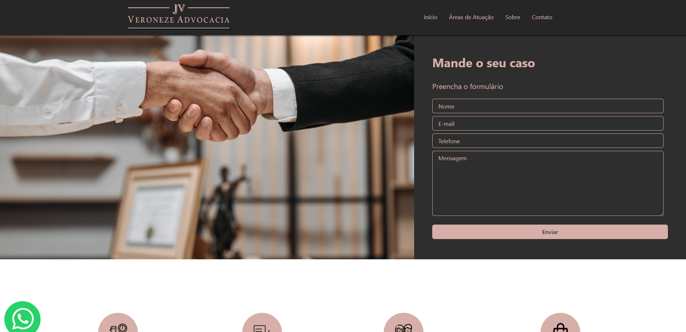
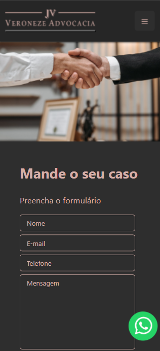

Website developed for a lawyer to prospect new customers using the form and disclosing contact methods.

The website was developed using NextJS and Chackra UI.
The site has mobile responsiveness considering that many customers can search using their smartphones.

the site contacts an API that is in my other repository that receives the form contained on the site and sends emails to the lawyer with the information and also to the client with confirmation of receipt of the contact.

You can check the website here [VeronezeAdvocacia](http://www.veronezeadvocacia.com.br/).

Mobile responsibility:

